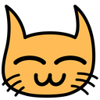

# XZoo

> 可爱的动物头像，为你设计。

## 背景

有人说喜欢我设计的小猫头像，希望给他也设计一个动物头像。于是我想，为什么不干脆开一家动物园呢？

## 协议

### 付费的全球独一无二的头像

1. XZoo 的头像均为付费资源，我将在这里公布它的所有者，其他人不可随意使用，也请不要随意使用，因为我希望把它们打造成你的全球独一无二的头像
2. 如果你喜欢已被别人购买的头像，那么你还有机会购买此头像的衍生品，或者可以让我为你设计一个新头像
3. 购买头像的人只拥有头像的**使用权**，可以用作头像、表情、贴图等场合，但是不可修改，转售，转赠，或用于其他商业目的
4. 我保留对所有资源的商业使用权和最终解释权

### 爱护你的头像

1. 一旦购买了动物头像，请爱护并珍惜它，把它设置为你的全球统一头像
2. 如果哪天你不爱它了，请告诉我，我会以 50% 的价格回收

## 动物园

英文名 | 中文名 | 头像预览 | 所有者 | 是否买断衍生品
------ | ------ | -------- | ------ | --------------
xcat | 流浪小猫 |  | [@xcatliu](https://github.com/xcatliu) | 是

## 如何购买

有两种购买方式。

第一种是在 GitHub 上提交 Issue，注意这是公开场合，所有人都看得到定价。

第二种是[发 email 给我](xcatliu@gmail.com)，我们可以私聊。

**注意**：提交了 Issue，并不代表一定能获得它的购买权。我会综合考虑再决定帮谁设计。

### 1. 开一个 Issue，格式如下：

```markdown
## 购买申请

- [x] 请帮我全新制作一个头像
- [ ] 请帮我制作一个衍生品
- [ ] 我想购买已有的头像

### 是否买断衍生权

- [x] 我想要买断它的衍生权，将来我可能会购买它的衍生品。

### 说明

我想要一个小狗的头像，最好能看得出来它是哈士奇。
```

### 2. 等待我的回复

我会回复确认你的需求，并且给出定价。

### 3. 确认购买

你确认无误后，支付 50% 的定价，此头像锁定为你的。

### 4. 等待我的制作

这个过程的时间取决于当前有多少等待制作的头像。短则一周，长则几个月。

### 5. 交付头像

交付头像后，你支付剩余的 50% 的定价，然后我会更新头像的所有者。

## 定价

我认为一个好的头像是很值钱的。比如我的头像，就经历了多轮重制，既可爱又醒目，印象深刻，全球唯一。我认为无论按工时计算还是按内在价值计算，它早已超过千元。

目前我还没有想好一个完善的定价系统，暂时会按照以下规则制定：

- 按照工时 * 工作成本（暂定 100 元/小时） * 稀有程度估算
- 买断衍生品需要两倍的价格
- 2017-01-01 之前订购，五折优惠（交付期可能是 2017-01-01 之后）
- 完成之后不满意有一次重制机会，还不满意可全额退款
- 衍生品是基于原始头像二次创作的，有一部分成本是由购买原始头像的人支付的，所以衍生品所得 5% 会返还给原始头像所有者
- 所有交易均以信用担保，请相信我的人品，我也会相信你的人品
- 如果哪天你不爱它了，请告诉我，我会以 50% 的价格回收

下面给出一些例子（不一定是最终定价）：

- xdog（小狗）： (1 小时设计 + 2 小时绘画 + 1 小时调整) * 100 元/小时 * 3 稀有程度 = 1200 元
- xeagle（老鹰）： (1 小时设计 + 2 小时绘画 + 1 小时调整) * 100 元/小时 * 1 稀有程度 = 400 元
- xeagle-crown（老鹰衍生 - 王冠）： (0.5 小时设计 + 1 小时绘画 + 0.5 小时调整) * 100 元/小时 * 1 稀有程度 = 200 元
